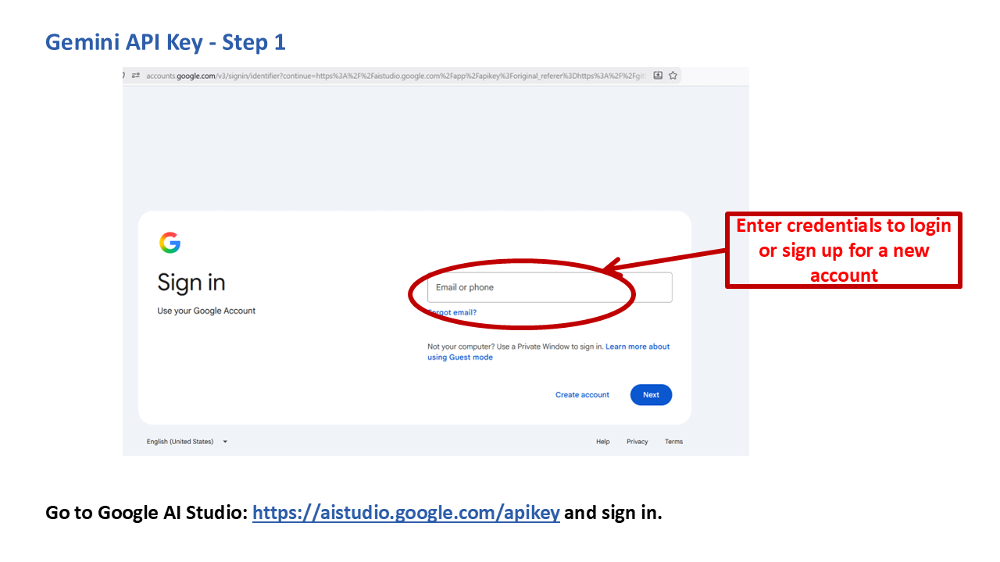
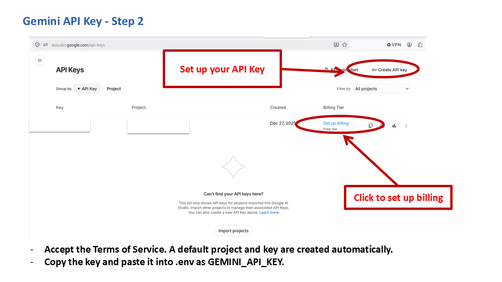

# Getting a Gemini API Key

RADIANT-LLM can use Google's Gemini models (e.g. `gemini-2.5`) as its chat model instead of OpenAI. You need **either** this key **or** an OpenAI key, not both, to run RADIANT-LLM at all. Gemini is the free option of the two.

## Is it free?

Yes. Google AI Studio automatically creates a default project and a free-tier API key for you the first time you sign in, no payment method required.

## Steps

1. Go to [Google AI Studio](https://aistudio.google.com/apikey) and sign in with a Google account.

   

2. On the API Keys page, your key is listed with **"Free tier"** already shown as its billing tier, that's the one RADIANT-LLM needs. Accept the Terms of Service if prompted, then copy the key.

   

3. Paste it into your `.env` file:

   ```
   GEMINI_API_KEY=AIzaSy...
   ```

## Things to know

- The API Keys page also shows a **"Set up billing"** link next to your key. That's an optional upgrade path, not a requirement, your key already shows "Free tier" as active without it. Leave it alone unless you specifically want to raise your rate limits.
- The same key also sometimes appears as `GOOGLE_API_KEY` in Google's own documentation; for RADIANT-LLM specifically, use the `GEMINI_API_KEY` variable name shown above, that's what the app reads from `.env`.
