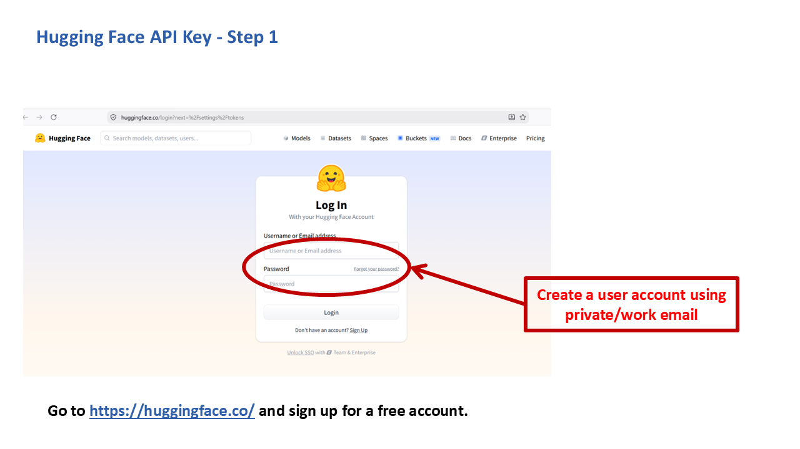
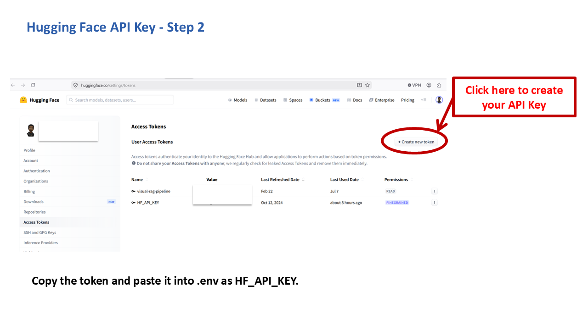

# Getting a Hugging Face API Key

RADIANT-LLM uses this key (`HF_API_KEY`) for document parsing in its retrieval-augmented generation (RAG) pipeline. Unlike most other keys in this collection, it's **required**: without it, document ingestion for the Visual-RAG knowledge base will not work.

## Is it free?

Yes, no payment method required.

## Steps

1. Go to [huggingface.co](https://huggingface.co) and create an account (or log in if you already have one), using an email address or an existing account.

   

2. Once logged in, go to **Settings → Access Tokens**, then click **"+ Create new token"**. Give it a name you'll recognize later, a **Read** permission level is enough for RADIANT-LLM's use.

   

3. Copy the generated token. It's only shown in full once, save it somewhere safe immediately.

4. Paste it into your `.env` file:

   ```
   HF_API_KEY=hf_...
   ```

## Things to know

- Hugging Face's own token list masks most of the value after creation (`hf_...xxxx`), that's normal and doesn't mean anything is wrong; just make sure you saved the full value when it was first shown.
- You can create multiple tokens with different names, useful if you want to tell RADIANT-LLM's usage apart from other projects later, but one token is all RADIANT-LLM needs.
