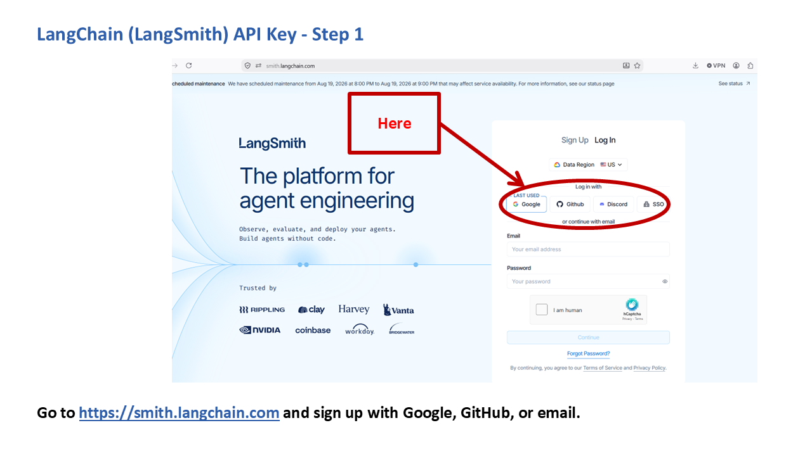
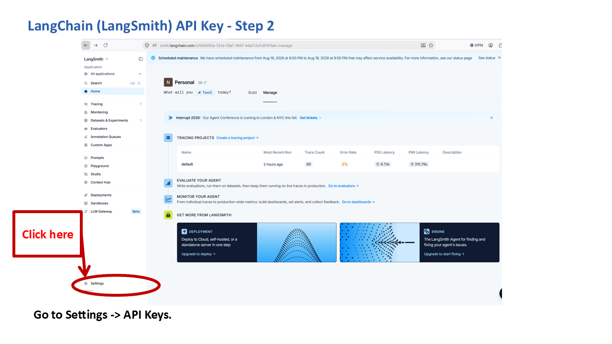
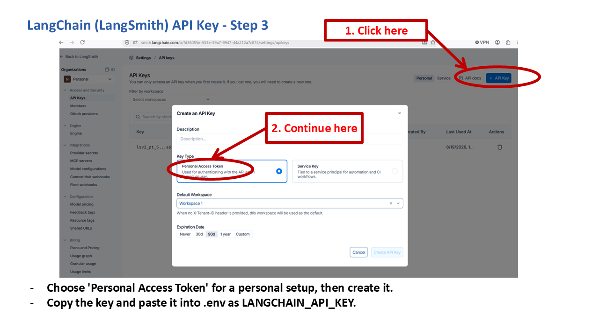

# Getting a LangChain (LangSmith) API Key

This key enables optional tracing and logging of RADIANT-LLM's internal agent steps through LangSmith. It's entirely optional: RADIANT-LLM works the same without it, you just won't have LangSmith's trace/debugging view available.

## Is it free?

Yes, LangSmith has a free tier for development and small-scale use, no payment method required to create an account and generate a key.

## Steps

1. Go to [smith.langchain.com](https://smith.langchain.com) and sign up using Google, GitHub, or email.

   

2. Once logged in, go to **Settings**.

   

3. Go to **API Keys**, click **"+ API Key"**, and choose **Personal Access Token** (the simpler choice for running RADIANT-LLM yourself, as opposed to a Service Key meant for shared production use), then create it.

   

4. Copy it immediately, LangSmith only displays the full value once, then paste it into your `.env` file:

   ```
   LANGCHAIN_API_KEY=lsv2_...
   ```

## Things to know

- LangChain's own current docs refer to the environment variable as `LANGSMITH_API_KEY` in some newer examples, but RADIANT-LLM specifically reads `LANGCHAIN_API_KEY` from `.env` (the same key value works either way, it's just a different variable name RADIANT-LLM happens to use internally).
