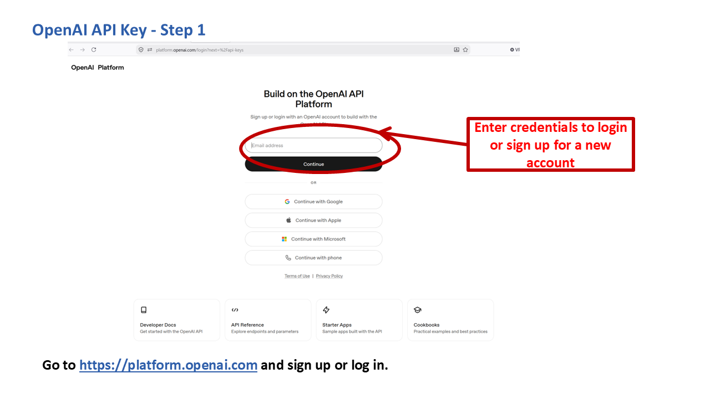
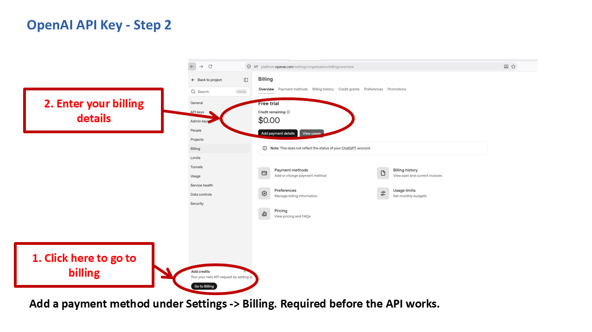
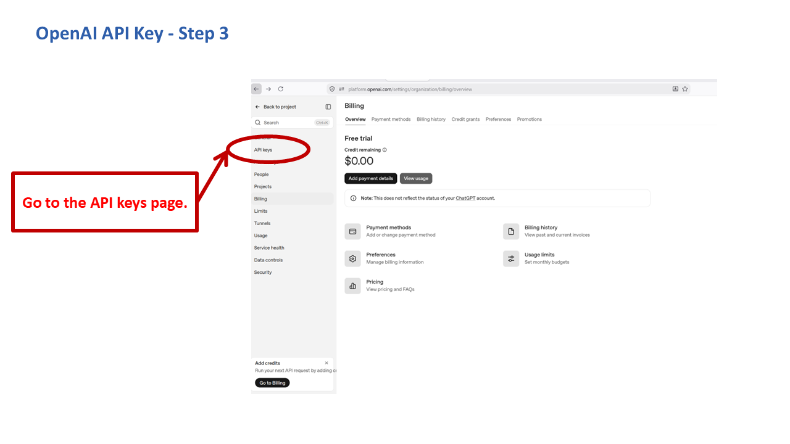
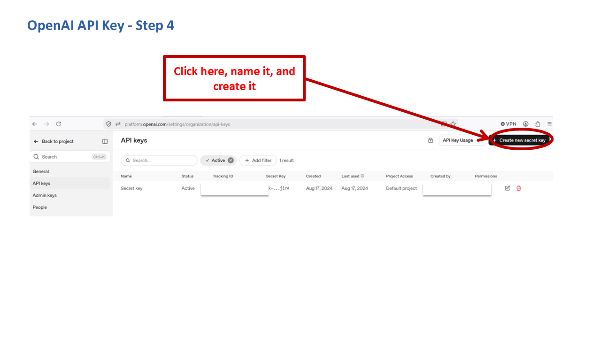
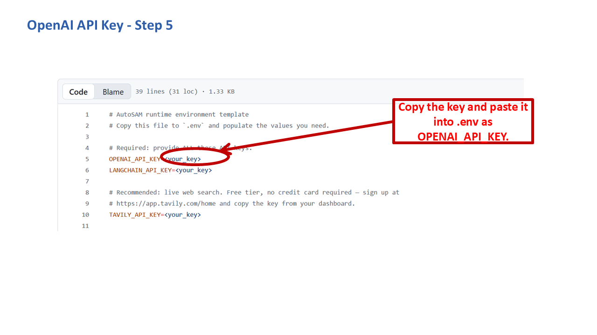

# Getting an OpenAI API Key

You need **either** this key **or** a [Gemini key](gemini.md) to run RADIANT-LLM at all; one of the two is required as RADIANT-LLM's chat model.

## Is it free?

**No**, unlike every other key in this collection. Using the OpenAI API (as opposed to the ChatGPT product) requires adding a payment method and prepaid or billed usage. If you want a free option instead, use [Gemini](gemini.md).

## Steps

1. Go to [platform.openai.com](https://platform.openai.com) and sign up or log in.

   

2. Add a payment method under **Settings → Billing**. The API will not return results without this, even for small amounts of usage.

   

3. Go to the **API keys** page from the left sidebar.

   

4. Click **"Create new secret key"**, optionally name it, and create it.

   

5. Copy the key immediately, it's shown only once, and paste it into your `.env` file:

   ```
   OPENAI_API_KEY=sk-...
   ```

   

## Things to know

- Set a usage limit under Billing if you want a hard cap on spend, OpenAI supports monthly budget limits per project.
- If you'd rather avoid billing setup entirely, [Gemini](gemini.md) covers the same required role (RADIANT-LLM's chat model) for free.
