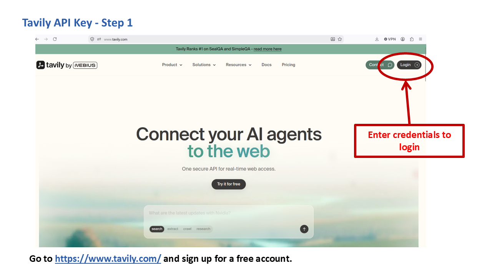
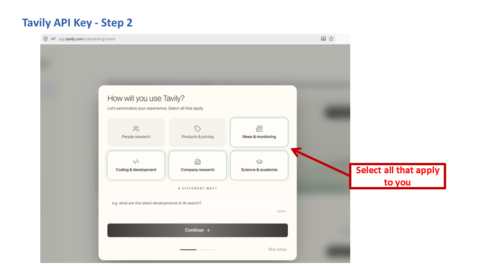
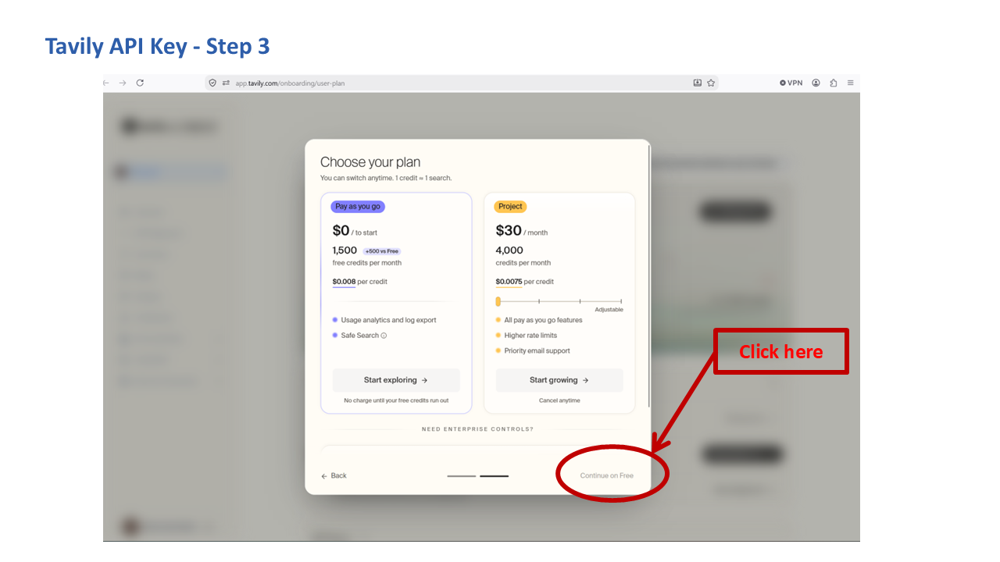
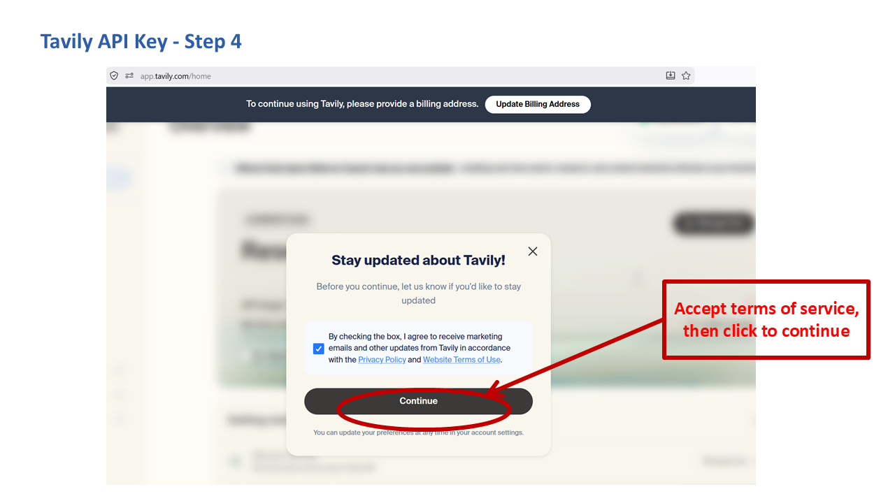
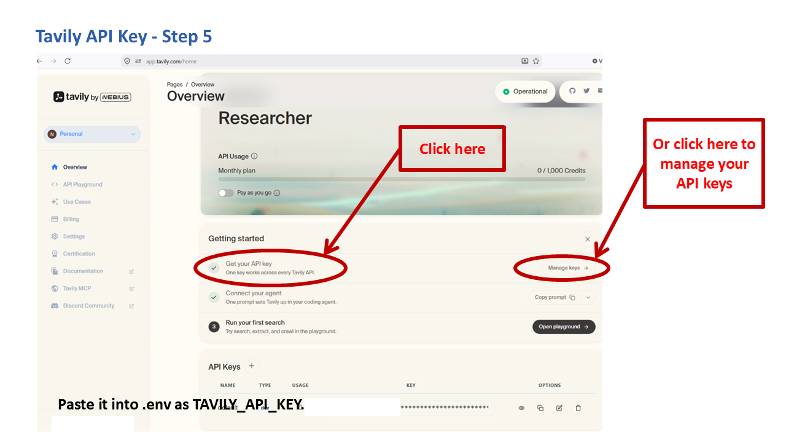

# Getting a Tavily API Key

Tavily powers RADIANT-LLM's live web search. It's optional: RADIANT-LLM runs fine without it, and skipping it only means the agent can't look up current information from the web.

## Is it free?

Yes. The free "Researcher" plan includes 1,000 search credits per month, no credit card required to sign up. One credit is roughly one search.

## Steps

1. Go to [tavily.com](https://www.tavily.com/) and click **Login** in the top right, or sign up directly, with an email address, Google, or GitHub.

   

2. You'll be asked a few quick onboarding questions ("How will you use Tavily?"). These are just for their own product analytics, answer honestly or pick anything.

   

3. Next is a "Choose your plan" screen with two options side by side: **Pay as you go** (highlighted, asks you to start a paid-capable plan) and **Project** ($30/month). Neither is what you want.

   **Click "Continue on Free" in the bottom-right corner instead.** It's small text, easy to miss next to the two prominent plan cards, but it's the option that actually matches the free, no-card-required plan.

   

4. You may land on a screen with a **"To continue using Tavily, please provide a billing address"** banner, plus a "Stay updated about Tavily!" popup with a marketing-email checkbox that's pre-checked by default. Uncheck it if you don't want marketing email. The billing-address banner is cosmetic: it does not block the API from working. Confirmed firsthand: a key created without ever addressing that banner still runs real searches successfully today.

   

5. On your account dashboard, find **API Keys**. A default key is already generated for you, starting with `tvly-`. Click the copy icon next to it.

   

6. Paste it into your `.env` file:

   ```
   TAVILY_API_KEY=tvly-...
   ```

## Things to know

- If you ever exhaust your free credits or Tavily has an outage, you can fall back to Google Custom Search — see the [Google Custom Search guide](google-custom-search.md) for the optional legacy path.
