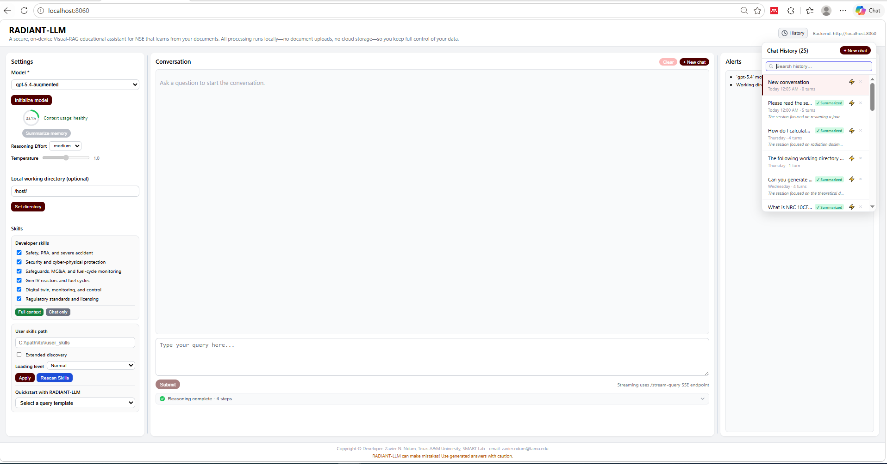
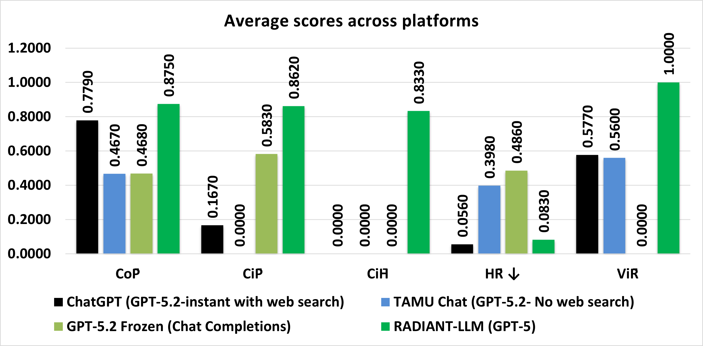
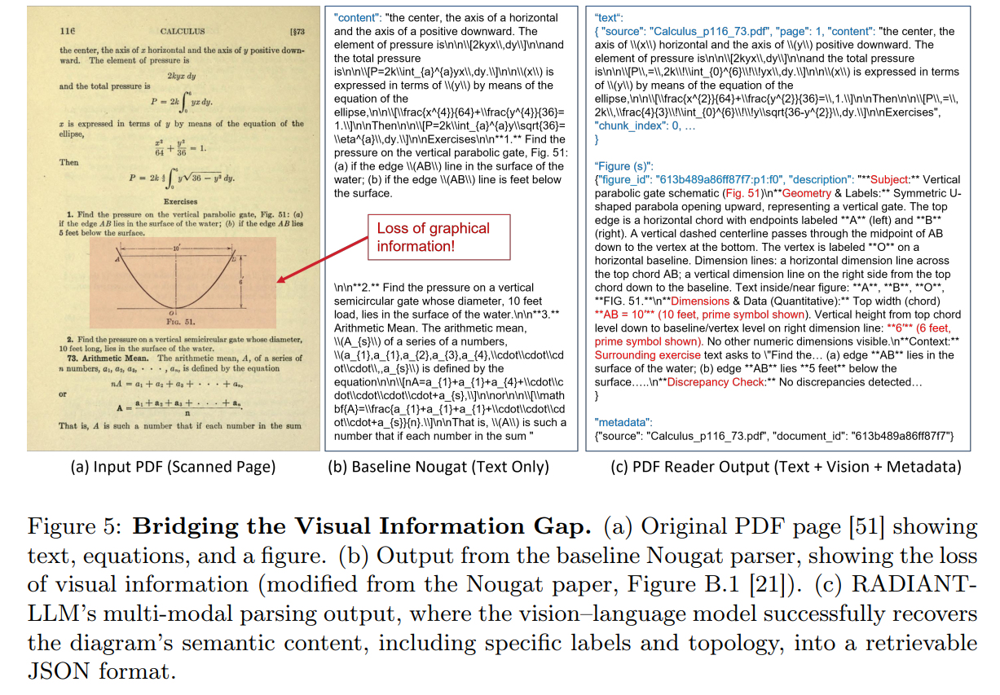
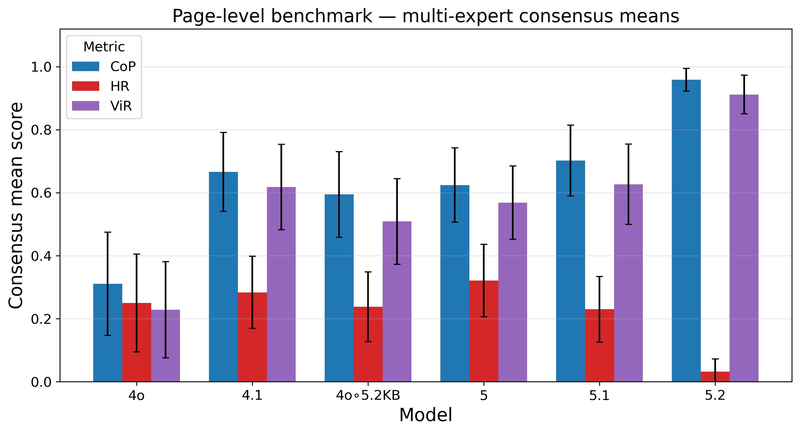
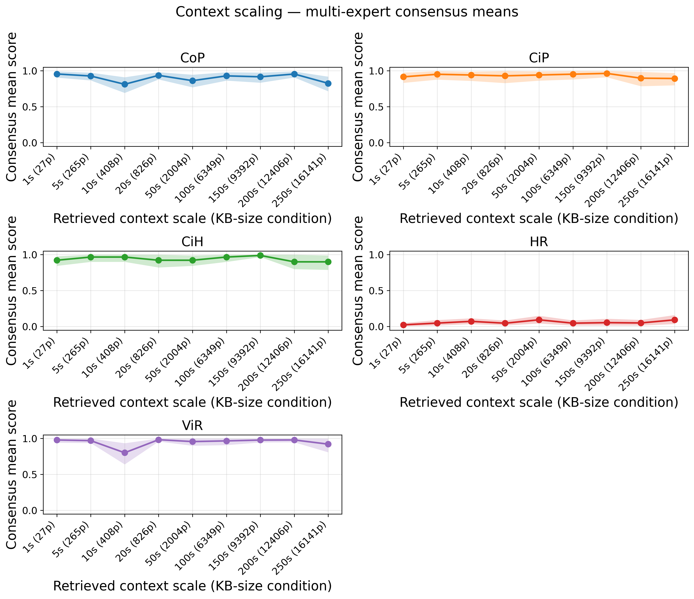

# RADIANT-LLM

<!--  -->

<!--  -->

<p align="center">
  <a href="./RADIANT_LLM_GUI_2_0.png">
    
  </a>
</p>

RADIANT-LLM (**R**etrieval-augmented **D**omain-intelligent assistant for **A**dvanced **N**uclear **T**echnologies) is a local-first, model-agnostic Visual-RAG (visual retrieval-augmented generation) system for secure, document-grounded assistance in Nuclear Science and Engineering (NSE). It combines multi-modal ingestion (text plus visual context) with a structured knowledge base to enable page- and figure-level retrieval from complex technical documents with auditable, citation-backed responses, while respecting privacy/security constraints by keeping data processing local and emphasizing auditable, citation-traceable outputs.

This repository also includes **`visual-parser`**, a standalone PDF ingestion tool for generating JSONL knowledge bases from curated documents. It is available on PyPI at https://pypi.org/project/visual-parser/ and can be used independently of the RADIANT-LLM chat UI.


## Table of Contents

1. [Highlights of the Methodology](#highlights-of-the-methodology)
2. [Highlights of the Results](#highlights-of-the-results)
3. [LearningCenter](#learningcenter)
4. [Evaluation Materials](#evaluation-materials)
5. [Standalone PDF Ingestion: visual-parser](#standalone-pdf-ingestion-visual-parser)
6. [Prerequisites: API Keys](#prerequisites-api-keys)
7. [Quick Start: Docker](#quick-start-docker-prebuilt-images)
8. [Local Models: Grace HPRC vLLM](#local-models-grace-hprc-vllm-optional)
9. [Troubleshooting](#troubleshooting)
10. [Citation](#citation)
11. [License](#license)

## Highlights of the Methodology
- Secure, document-grounded Visual-RAG layer for NSE-based knowledge management 
- Multi-modal ingestion with page/figure-aware retrieval and citations.
- Domain-aware evaluation metrics: Context Precision (CoP), Citation Precision (CiP), Citation Hit (CiH), Hallucination Rate (HR), and Visual Recall (ViR).

## Highlights of the Results 

### Cross-platform performance on UNFSF Visual-RAG benchmark

RADIANT-LLM's Visual-RAG layer, powered by GPT-5 over a local 250-source multi-modal knowledge base constructed with GPT-5.2, achieved the highest overall correctness (CoP = 0.875), perfect visual recall (ViR = 1.000), low hallucination (HR = 0.083), and strong citation performance (CiP = 0.862, CiH = 0.833) on twelve expert-curated UNFSF diagnostic queries. ChatGPT with web access and institutional/frozen GPT-5.2 baselines showed weaker page- and figure-level grounding, with no expert-defined anchor hits (CiH = 0).

<a href="Average_scores_platforms.png"></a>

### Bridging the visual information gap in scientific PDFs
Baseline Nougat parsing loses diagrams and layout, dropping critical visual semantics from complex NSE pages. RADIANT-LLM's multi-modal parsing strategy recovers the visual topology, labels, and relationships into structured data records, making visual content first-class, retrievable evidence for downstream Visual-RAG.

<a href="Visual_Information_Gap.PNG"></a>

### Page-level visual grounding and knowledge-base fidelity
Across the 30-query page-level benchmark, RADIANT-LLM powered by GPT-5.2 achieved the strongest consensus performance (CoP = 0.958, ViR = 0.911, HR = 0.032). The same benchmark also shows the importance of knowledge-base construction fidelity: GPT-4o improved substantially when queried against a GPT-5.2-constructed multi-modal KB instead of its own page-level KB. These results show that reliable Visual-RAG depends on both model reasoning and high-fidelity ingestion of schematic, geometric, and figure-level evidence.

<a href="radiant-llm-evaluation/final_statistical_analysis/Plots/figure_page_level_bars.png"></a>

### Sensitivity to context scaling in Visual-RAG

For GPT-5.2 on the UNFSF context-scaling benchmark, performance remained strong as the knowledge base expanded from 1 source (27 pages) to 250 sources (16,141 pages). Across conditions, the higher-is-better metrics stayed in strong bands (CoP: 0.813-0.956, CiP: 0.893-0.964, CiH: 0.900-0.989, ViR: 0.802-0.983), while hallucination remained low (HR: 0.024-0.094). Statistical trend testing found no significant monotonic degradation with corpus size, supporting the use of RADIANT-LLM as a reliable QA assistant with expert oversight.

<a href="radiant-llm-evaluation/final_statistical_analysis/Plots/figure_context_scaling_lines.png"></a>

---

## LearningCenter

The [`LearningCenter/`](LearningCenter/) folder contains a public-facing tutorial notebook for readers who want a compact introduction to RAG concepts before diving into the full Visual-RAG system.

- Notebook: [`LearningCenter/RAG_Agent_Workshop.ipynb`](LearningCenter/RAG_Agent_Workshop.ipynb)
- Folder guide: [`LearningCenter/README.md`](LearningCenter/README.md)

The notebook uses the repository's own supplementary material PDF as its default document source, so the walkthrough stays tied to the RADIANT-LLM methodology and evaluation context rather than a generic toy example.

If the repository, notebook, or evaluation materials support your work, please cite the RADIANT-LLM paper using the metadata in [`CITATION.cff`](CITATION.cff).

---

## Evaluation Materials
The evaluation package in [`radiant-llm-evaluation/`](radiant-llm-evaluation/) includes the supplementary material PDF, benchmark query files, scoring rubrics, expert scoring files, model responses, and statistical plots used to support the reported RADIANT-LLM results.

- Supplementary material: [`radiant-llm-supplementary-material.pdf`](radiant-llm-evaluation/radiant-llm-supplementary-material.pdf)
- Page-level benchmark materials: [`Page_level/`](radiant-llm-evaluation/Page_level/)
- Context-scaling benchmark materials: [`Context_scaling/`](radiant-llm-evaluation/Context_scaling/)
- Final statistical plots: [`final_statistical_analysis/Plots/`](radiant-llm-evaluation/final_statistical_analysis/Plots/)

---

## Standalone PDF ingestion: `visual-parser`

This repo also includes `visual-parser`, a standalone PDF ingestion tool that accelerates document processing by generating JSONL knowledge bases (text chunks + figure descriptions + metadata) from curated PDFs. You can run `visual-parser` first to build a high-fidelity, multi-modal KB, then run RADIANT-LLM Visual-RAG for QA over that KB.

See [`codebase/Visual-Parser/README.md`](codebase/Visual-Parser/README.md) for CLI/Docker usage and model configuration options.

---

## Prerequisites: API keys

You will typically need at least one LLM provider API key.

Key sources:

- OpenAI API key [here](https://platform.openai.com/api-keys), or Gemini API key (optional, including free access for `gemini-2.5`) [here](https://aistudio.google.com/app/apikey)
- LangChain (LangSmith) API key (optional, for tracing/logs) [here](https://www.langchain.com/langsmith)
- Google Custom Search API key [here](https://developers.google.com/custom-search/v1/introduction)
- Google Custom Search Engine ID [here](https://programmablesearchengine.google.com/controlpanel/overview)
- Hugging Face API key (`HF_API_KEY`, required for document parsing in RAG) [here](https://huggingface.co/settings/tokens)
---

## Quick Start: Docker (prebuilt images)

Prebuilt images are published on Docker Hub: **[zev94/radiant-llm](https://hub.docker.com/r/zev94/radiant-llm)**.  

| Tag | Application |
|-----|-------------|
| `2.0`, `latest` | **RADIANT-LLM** - chat UI for Visual-RAG over your knowledge base |
| `visual-parser-1.0.2`, `visual-parser-latest` | **visual-parser** - PDF to JSONL knowledge-base ingestion |

### Prerequisites
- Docker Desktop (Windows/macOS) or Docker Engine (Linux)
- A `.env` file with at least one LLM provider key (`OPENAI_API_KEY`, `GEMINI_API_KEY`, etc.)
- (Optional, for GPU) NVIDIA GPU + recent drivers + NVIDIA Container Toolkit (`docker run --gpus all`)

### 1) Pull RADIANT-LLM
```bash
docker pull zev94/radiant-llm:2.0
docker pull zev94/radiant-llm:latest
```

Windows PowerShell:
```powershell
docker pull zev94/radiant-llm:2.0
docker pull zev94/radiant-llm:latest
```

### 2) Run RADIANT-LLM

The container serves the web UI on port **8080** internally, mapped to host port **8060**.

Four volumes are mounted:
- **Skills** (`radiant_llm_skills/`) — read-only bundled/developer skills
- **Host data** (`/host`) — working directory for PDF/CSV/image tools
- **Logs** (`RADIANT_LLM_Logs/`) — streaming and reasoning logs, persisted on host
- **Sessions** (`RADIANT_LLM_Sessions/`) — chat session history, persisted on host

#### Option A — Docker Compose (recommended)

A ready-to-use `docker-compose.yml` is provided in [`Docker_Executable/`](Docker_Executable/). Edit the volume paths to match your machine, copy `.env.example` to `.env` and fill in your API keys, then:

```bash
cd Docker_Executable
docker compose up -d          # start in background
docker compose logs -f        # follow logs
docker compose down           # stop and remove container
docker compose up -d --pull always   # pull latest image + restart
```

Persistent data lands in `Docker_Executable/RADIANT_LLM_Logs/` and `Docker_Executable/RADIANT_LLM_Sessions/` on your host.

#### Option B — Plain `docker run`

Windows PowerShell:
```powershell
docker run -d --name radiant-llm `
  -p 8060:8080 `
  --env-file .env `
  -e RADIANT_LLM_SESSION_DIR=/radiant-llm/RADIANT_LLM_Sessions `
  -v "C:\path\to\radiant_llm_skills:/radiant-llm/radiant_llm_skills:ro" `
  -v "C:\path\to\your\data:/host" `
  -v "${PWD}\RADIANT_LLM_Logs:/radiant-llm/RADIANT_LLM_Logs" `
  -v "${PWD}\RADIANT_LLM_Sessions:/radiant-llm/RADIANT_LLM_Sessions" `
  zev94/radiant-llm:latest
```

WSL (Ubuntu):
```bash
docker run -d --name radiant-llm \
  -p 8060:8080 \
  --env-file .env \
  -e RADIANT_LLM_SESSION_DIR=/radiant-llm/RADIANT_LLM_Sessions \
  -v "/mnt/c/path/to/radiant_llm_skills:/radiant-llm/radiant_llm_skills:ro" \
  -v "/mnt/c/path/to/your/data:/host" \
  -v "$PWD/RADIANT_LLM_Logs:/radiant-llm/RADIANT_LLM_Logs" \
  -v "$PWD/RADIANT_LLM_Sessions:/radiant-llm/RADIANT_LLM_Sessions" \
  zev94/radiant-llm:latest
```

Linux:
```bash
docker run -d --name radiant-llm \
  -p 8060:8080 \
  --env-file .env \
  -e RADIANT_LLM_SESSION_DIR=/radiant-llm/RADIANT_LLM_Sessions \
  -v "/path/to/radiant_llm_skills:/radiant-llm/radiant_llm_skills:ro" \
  -v "/path/to/your/data:/host" \
  -v "$PWD/RADIANT_LLM_Logs:/radiant-llm/RADIANT_LLM_Logs" \
  -v "$PWD/RADIANT_LLM_Sessions:/radiant-llm/RADIANT_LLM_Sessions" \
  zev94/radiant-llm:latest
```

Pin `zev94/radiant-llm:2.0` instead of `latest` for the fixed 2.0 release. Optional (GPU): add `--gpus all`.
### 3) Open the web GUI
```text
http://localhost:8060
```

Verify / tail logs:
```bash
docker ps
docker logs -f radiant-llm
```

### 4) Set Working Directory and user_skills in the UI
Use a path **inside the container** under your mounted host folder, for example:
```text
/host
```

If you mounted a larger host data root, set the working directory to a subfolder under `/host`, for example:
```text
/host/project_a
```

If the UI auto-fills the **user_skills** field, keep it on a writable path under `/host` such as:
```text
/host/user_skills
```

You only need to change that field if you intentionally mounted a different writable skills location.
### 5) Pull and run visual-parser (optional)
Build a multi-modal JSONL knowledge base before or alongside RADIANT-LLM QA. See [`visual-parser/README.md`](visual-parser/README.md) for CLI flags.

```bash
docker pull zev94/radiant-llm:visual-parser-latest
```

Windows PowerShell:
```powershell
docker run --rm --env-file .env `
  -v "C:\path\to\pdfs:/data" `
  zev94/radiant-llm:visual-parser-latest `
  --input-dir /data --output-dir /data
```

WSL / Linux:
```bash
docker run --rm --env-file .env \
  -v "/path/to/pdfs:/data" \
  zev94/radiant-llm:visual-parser-latest \
  --input-dir /data --output-dir /data
```

Help:
```bash
docker run --rm zev94/radiant-llm:visual-parser-latest --help
```

---

### Offline install (legacy `.tar` releases)

If you have a release `.tar` instead of Hub access:

```powershell
docker load -i .\radiant-llm_0.1.0.tar
docker images   # use the tag printed by Docker
```

Older images used port `8050`, mount path `/host_data`, and log folder `DecodedAI_logs`. Current Hub images use `8060:8080`, `/host`, and **`RADIANT_LLM_Logs`** to `/radiant-llm/RADIANT_LLM_Logs`.

---

## Local Models: Grace HPRC vLLM (optional)

RADIANT-LLM supports self-hosted inference via [vLLM](https://docs.vllm.ai) on the Texas A&M University (TAMU) Grace High Performance Research Computing (HPRC) cluster (or any compatible Slurm + A100 cluster). When configured, Grace model variants appear alongside cloud models (GPT, Gemini) in the model selector — no cloud API key is needed for inference.

**Available variants:**

| Variant | GPUs | Quantization | Context window |
|---------|------|--------------|----------------|
| Grace Gemma 4 26B-A4B | 1× A100 | FP8 | 16,384 tokens |
| Grace Gemma 4 31B | 1× A100 | FP8 | 16,384 tokens |
| Grace Gemma 4 31B (bf16) | 2× A100 | None (full precision) | 4,096 tokens |

**How it works:** A Slurm job runs vLLM on a Grace GPU compute node. An SSH tunnel on your local machine (or Docker host) forwards requests from RADIANT-LLM to that node. No model weights or GPU compute leave the cluster.

**Setup guide:** [`developer_scripts/README.md`](developer_scripts/README.md) — covers Grace account prerequisites, one-time model download, sbatch job templates, tunnel management scripts, and troubleshooting.

> **Docker users:** The SSH tunnel binds to your host machine. RADIANT-LLM running in Docker reaches it automatically via `host.docker.internal` — the provided `docker-compose.yml` and `.env` in this repo already have this configured.

---

## Troubleshooting

- **pull access denied / repository does not exist**
  - Log in: `docker login`
  - Use the full image name: `zev94/radiant-llm:1.0` (not a local-only name unless you built or loaded it yourself).

- **Invalid directory. Default temporary directory is being used**
  - The UI working-directory path must exist inside the container.
  - Match the right-hand side of your volume mount (for example mount to `/host`, then use `/host/...` in the UI).

- **Skills not loading**
  - Mount skills at `/radiant-llm/radiant_llm_skills`, or set **Skills directory** in Settings to your custom mount path.

- **GPU not detected**
  - Verify GPU support with: `docker run --gpus all nvidia/cuda:12.2.0-base-ubuntu22.04 nvidia-smi`

---

## Citation

If you use RADIANT-LLM or the accompanying evaluation materials, please cite the preprint:

```bibtex
@article{ndum2026radiant,
  title={RADIANT-LLM: an Agentic Retrieval Augmented Generation Framework for Reliable Decision Support in Safety-Critical Nuclear Engineering},
  author={Ndum, Zavier Ndum and Tao, Jian and Ford, John and Yim, Mansung and Liu, Yang},
  journal={arXiv preprint arXiv:2604.22755},
  year={2026}
}
```

Preprint: https://arxiv.org/abs/2604.22755

---

## License

This repository is publicly visible for research preview and reference purposes, but it is not yet released under an open-source license. No permission is granted at this time for redistribution, modification, or production reuse. Licensing terms will be updated after journal publication and institutional review.
